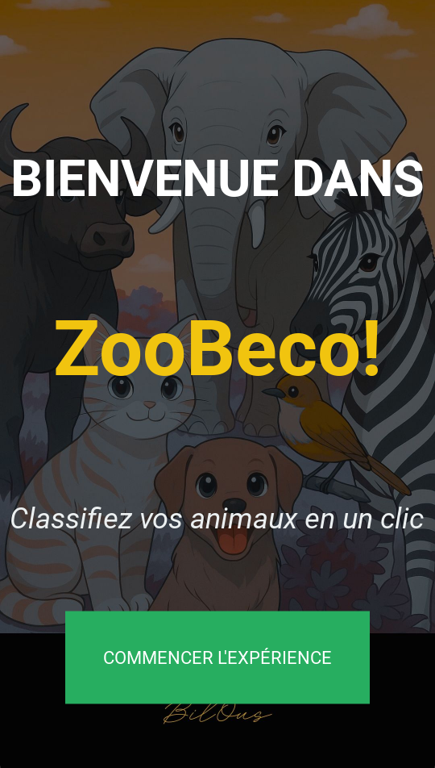
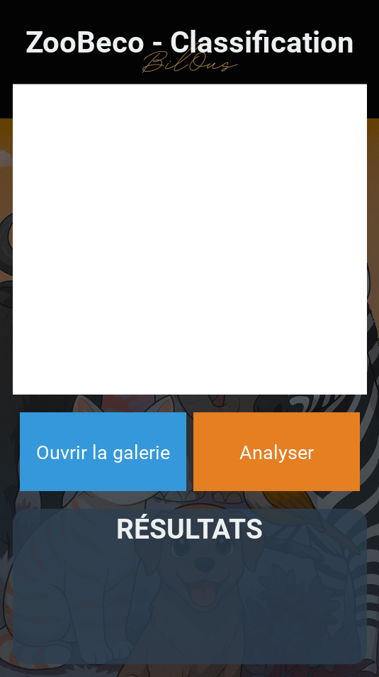
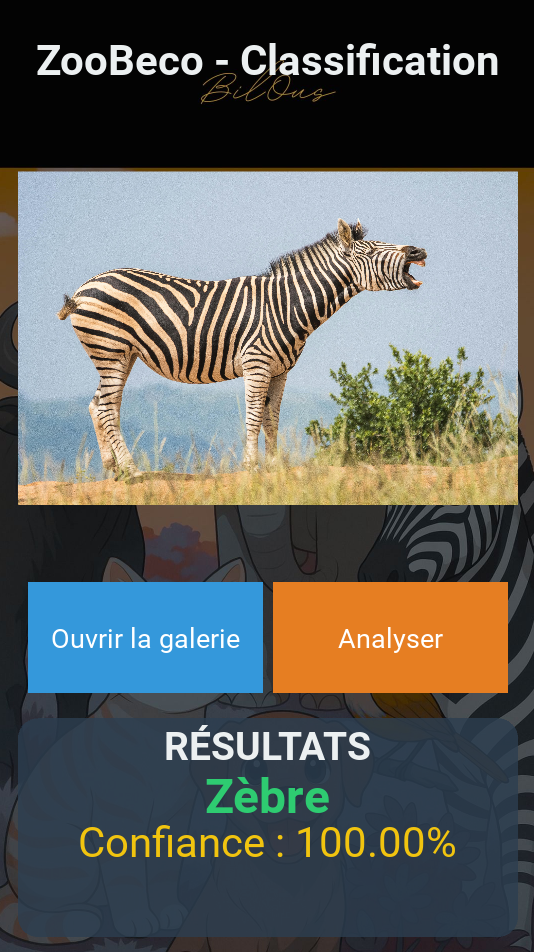
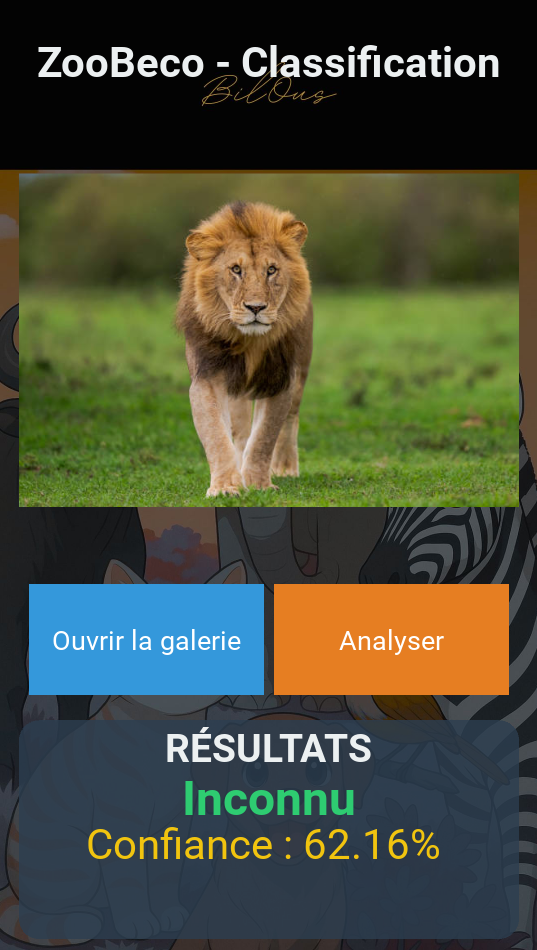
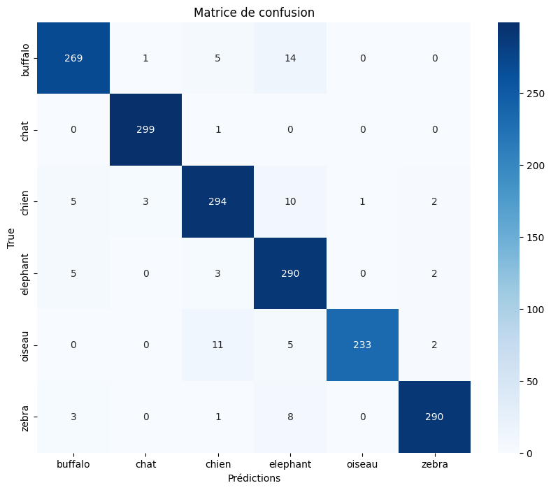
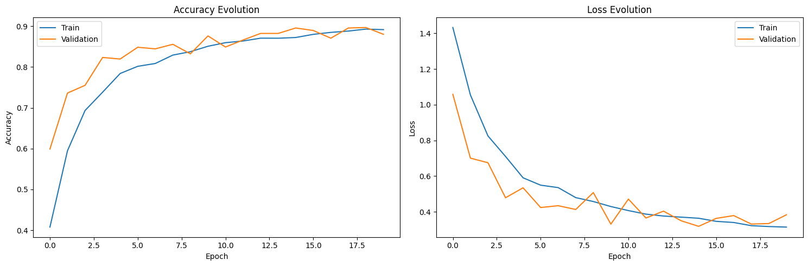

# 🦓 ZooBeco — Classification multi-classes d'images d'animaux (CNN)


> **EN —** End-to-end computer-vision project: a custom CNN (TensorFlow/Keras) that classifies 6 animal species (buffalo, cat, dog, elephant, bird, zebra) with **89.3 % test accuracy**, packaged in a Kivy app with a confidence threshold (< 70 % → "Unknown"). Built as a final-year project (PFE) at the Faculty of Sciences, Kénitra.

**ZooBeco** est un projet de fin d'études (PFE) de bout en bout : conception et entraînement d'un réseau de neurones convolutif (CNN) pour classer **6 espèces animales**, puis intégration du modèle dans une **application Kivy** avec un seuil de confiance qui évite les prédictions peu fiables.

📄 **Rapport complet (84 pages)** : [`report/`](report/)

---

## 🎯 Objectifs

- Construire un **CNN personnalisé** capable de distinguer des espèces visuellement proches (chat/chien, buffle/éléphant…).
- Mettre en place un pipeline complet : **collecte et préparation des données → augmentation → entraînement → évaluation → déploiement**.
- Rendre le modèle utilisable via une **application avec interface graphique** et un retour clair à l'utilisateur (nom de l'animal + score de confiance).

## 📸 Aperçu de l'application

| Logo | Accueil | Analyse | Résultat : Zèbre | Résultat : « Inconnu » |
|:---:|:---:|:---:|:---:|:---:|
|  |  |  |  |  |

*Le lion ne fait pas partie des 6 classes : le modèle répond 62,16 % de confiance, sous le seuil de 70 %, et l'application affiche « Inconnu » au lieu d'inventer une réponse.*

## 🗂️ Dataset

Dataset personnalisé d'environ **17 400 images** compilées depuis Kaggle, images.cv et des recherches ciblées (savane, forêt…).

| Ensemble | Images | Usage |
|---|---:|---|
| Entraînement | 13 710 | Apprentissage (avec augmentation) |
| Validation | 1 931 | Réglage et détection du surapprentissage |
| Test | 1 757 | Évaluation finale, jamais vu pendant l'entraînement |

Classes : `Buffalo`, `Chat`, `Chien`, `Éléphant`, `Oiseau`, `Zèbre` (légèrement déséquilibrées : de 1 750 à 2 737 images par classe en entraînement).

📥 **Télécharger le dataset** : [Google Drive](https://drive.google.com/drive/folders/1I0NUckddHXeDYYhCmSI2-LihaylpJTFT?usp=sharing)

> Les images proviennent de sources tierces (Kaggle, images.cv) et restent soumises à leurs licences respectives.

## 🧠 Méthodologie

**Prétraitement** : redimensionnement 224×224 (RGB), normalisation des pixels `rescale=1/255`.

**Augmentation (train uniquement)** : rotation ±25°, décalages 20 %, cisaillement 20 %, zoom 20 %, flip horizontal, `fill_mode='nearest'`.

**Architecture (modèle séquentiel)**

```
Input (224×224×3)
 → Conv2D (64 filtres, 3×3, ReLU) → MaxPooling 2×2
 → Conv2D (3×3, ReLU)             → MaxPooling 2×2
 → Flatten
 → Dense (512, ReLU) → Dropout (0.5)
 → Dense (softmax)   → 6 classes
```

**Entraînement**

| Paramètre | Valeur |
|---|---|
| Optimiseur | Adam, learning rate 0.001 (décroissance de 10 % après 10 époques) |
| Batch size | 32 |
| Époques | 20 max |
| Callbacks | `EarlyStopping` (val_loss, patience = 5), `ModelCheckpoint` (meilleure val_accuracy) |

## 📊 Résultats

| Métrique | Valeur |
|---|---|
| **Accuracy (test)** | **89.3 %** |
| Meilleure val_accuracy | 89.6 % (époque 15) |
| F1-score — Chat | 99.7 % |
| F1-score — Zèbre | 97.2 % |

<p align="center">
  
  
</p>

**Analyse des erreurs** : les confusions principales sont **Buffalo ↔ Éléphant** (14 erreurs, contexte de savane similaire) et **Chien ↔ Oiseau** (11 erreurs, poses dynamiques, arrière-plans chargés). La classe **Chat** est la plus robuste (299 images bien classées sur ~300).

## 📱 Application ZooBeco

- Interface **Kivy** (`main.py` pour la logique, `zoo.kv` pour le design) : accueil → analyse → résultat.
- Choix d'une image depuis la galerie, prédiction par le modèle `animal_classifierv7.keras`.
- **Seuil de confiance de 70 %** : en dessous, l'application affiche « Inconnu » avec un retour sonore d'erreur.
- Retours sonores et visuels (succès / erreur).

## 🚀 Installation et lancement

```bash
# 1. Cloner le dépôt (Git LFS requis pour le modèle .keras)
git lfs install
git clone https://github.com/Bilal-Jellaoui/zoobeco-animal-classifier.git
cd zoobeco-animal-classifier

# 2. (Recommandé) environnement virtuel
python -m venv venv
venv\Scripts\activate          # Windows
# source venv/bin/activate     # Linux / macOS

# 3. Dépendances
pip install -r requirements.txt

# 4. Lancer l'application
cd ZooBeco
python main.py
```

Pour **ré-entraîner le modèle**, télécharger le dataset (lien ci-dessus), l'organiser en `train/ validation/ test/` (un sous-dossier par classe), puis exécuter `notebooks/code_source.ipynb`.

## 📁 Structure du dépôt

```
zoobeco-animal-classifier/
├── README.md
├── requirements.txt
├── report/                  # Rapport PFE complet (PDF)
├── notebooks/
│   └── code_source.ipynb    # Préparation, entraînement, évaluation
├── ZooBeco/                 # Application Kivy
│   ├── main.py
│   ├── zoo.kv
│   ├── assets/              # images et sons
│   └── models/
│       └── animal_classifierv7.keras   # modèle final (Git LFS)
└── docs/
    ├── screenshots/         # captures de l'application
    └── training-results/    # matrice de confusion, courbes, métriques
```

## ⚠️ Limites et pistes d'amélioration

- Seulement **6 classes** : un animal hors liste est rejeté uniquement grâce au seuil de confiance (pas de vraie classe « autre »).
- Confusions résiduelles sur images floues, occultées ou à arrière-plan complexe.
- **Pistes** : *transfer learning* (MobileNetV2, EfficientNet) pour dépasser les ~89 %, élargissement du nombre d'espèces, mode vidéo en direct, packaging Android (APK).

## 🛠️ Compétences mises en œuvre

Deep Learning (CNN) · TensorFlow / Keras · Data augmentation · Évaluation de modèles (matrice de confusion, précision, rappel, F1) · Gestion de la régularisation (Dropout, EarlyStopping) · Python · Développement d'interface (Kivy) · Rédaction technique

## 👥 Auteurs

**Bilal Jellaoui** · [GitHub](https://github.com/Bilal-Jellaoui) · [LinkedIn](https://www.linkedin.com/in/bilal-jellaoui-381594170) · bilaljellaoui@gmail.com
**Oussama Bouffi**

Projet de fin d'études — Filière Sciences Mathématiques et Informatique (SMI), Faculté des Sciences de Kénitra, Université Ibn Tofaïl · Année 2024–2025
Encadrante : Mme Khadija Louzaoui · Encadrant universitaire : Pr. Mohamed Amnai
